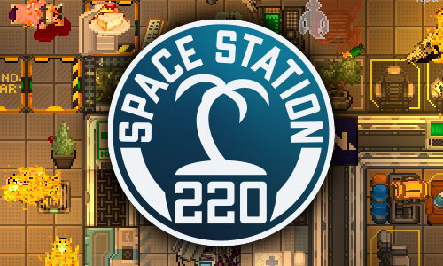

<!--- Hide title & edit button -->

  <!--- Left Quote -->
  

    <i>❝ <b>SS220</b> - один из лучших русскоязычных серверов в своём роде. Безупречная производительность, многомилионное финансирование, огромный штат разработки, главный маппер Дельты, гениальные ивенты, способные заставить плакать самого Хидео Кодзиму - всё это вы найдёте только здесь. Этот билд - Ведьмак от мира Space Station 14, а разработчики подобны Кармаку. ❞
      </i>
    <b>12/10 -IGN</b></style>
  

  <!--- Center image -->
  

    
  

  <!--- Left Quote -->
  

    <i>❝ Некомпетентность. Бездарность. Срочники. ❞</i>
  

- :fontawesome-brands-html5: __HTML__ for content and structure
  

  <ul>
  <li class="server_button" data-serveruri="https://s2.ss220.club:1212">
    
<b>Сервер: Орион</b>Секрет 00:48 Онлайн: 85/85

  </li>
  </ul>

  <ul>
  <li class="server_button" data-serveruri="https://s2.ss220.club:1213">
    
<b>Сервер: Персей</b>Секрет 01:04 Онлайн: 85/85

  </li>
  </ul>
  

  

  <ul>
  <li class="index-discord-button">
    Сервер Дискорд
  </li>
  </ul>

  <ul>
  <li class="index-github-button">
    Карты станций
  </li>
  </ul>
  

- :fontawesome-brands-css3: __CSS__ for text running out of boxes
- :fontawesome-brands-internet-explorer: __Internet Explorer__ ... huh?
- :fontawesome-brands-html5: __HTML__ for content and structure
- :fontawesome-brands-js: __JavaScript__ for interactivity
- :fontawesome-brands-css3: __CSS__ for text running out of boxes
- :fontawesome-brands-internet-explorer: __Internet Explorer__ ... huh?
- :fontawesome-brands-html5: __HTML__ for content and structure
- :fontawesome-brands-js: __JavaScript__ for interactivity
- :fontawesome-brands-css3: __CSS__ for text running out of boxes

